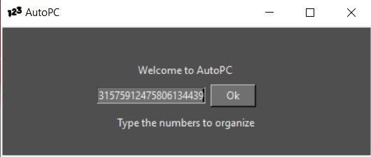
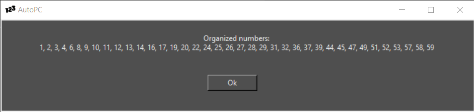

# COCorganizador-py

Programa criado para copiar e colar direto os numeros não formatados do site: "https://centrooestecap.com.br/resultados-cc/"
E me mostrar eles organizados em ordem crescente.

Foi utilizado <b>TkInter</b>

## Preview

- ### Index

- ### Números
 
